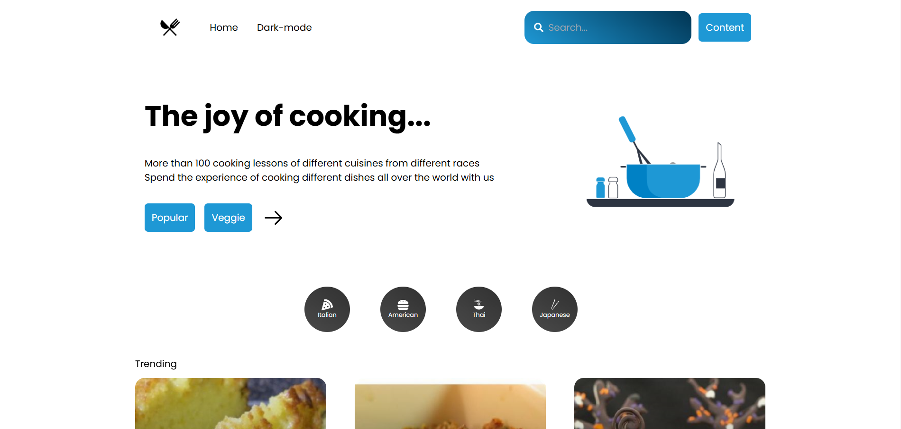
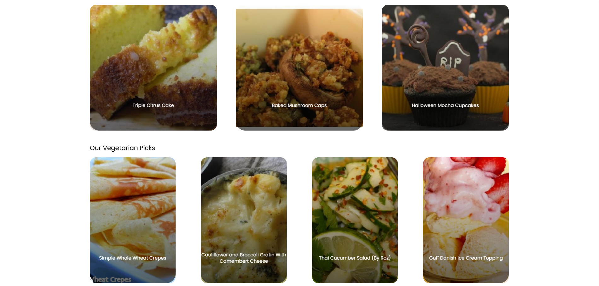

# The Recipe Site by reactjs

Hello everyone, in this project : 
I tried to complete this project by using the popular JavaScript framework , Reactjs
and by using the TypeScript language, Tailwind framework and [Lottiefiles animations](https://lottiefiles.com/).🔥





## Project features
1. Ability to search foods and categorize them appropriately
2. just 23 line css code 🤯 (often by tailwind).
3. 5 page by react-router-dom.
4. this project completely written by typescript. 
5. API and data are used because of the unavailability of the back-end developer, the site [spoonacular](https://spoonacular.com/food-api) fake API.

## Features that will be added in the future:

- Responsive
- Dark mode 

## Part of App.tsx
```javascript
function App() {
  const location = useLocation();
  return (
    <>
      <NavBar />
      <Category />
      <AnimatePresence mode='wait'>
        <Routes location={location} key={location.pathname}>
          <Route element={<Main />} path='/' />
          <Route element={<Cuisine />} path='/cuisine/:type' />
          <Route element={<Searched />} path='/searched/:search' />
          <Route element={<Recipe />} path='/recipe/:name' />
          <Route element={<Recipe />} path='/cuisine/:type/recipe/:name' />
        </Routes>
      </AnimatePresence>
      <Footer />
    </>
  );
}

export default App;
```

## For more :
[github](https://github.com/mjmajlesi) <br>
[telegram](https://t.me/Mj_majlesi)