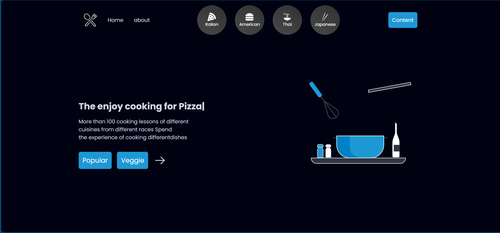
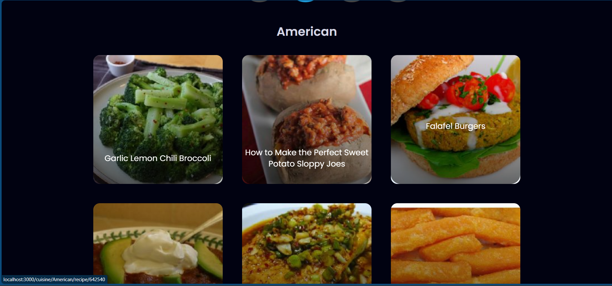
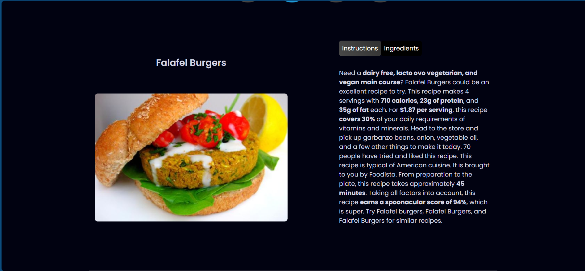

# Savora — Recipe Explorer 🍳

A recipe explorer built with React, TypeScript and Tailwind CSS. Browse trending dishes, vegetarian picks and cuisines from around the world.

### Main page



### Search & details





## Features

1. Search any dish, browse by cuisine (Italian, American, Thai, Japanese)
2. Trending & vegetarian carousels with skeleton loading states
3. Recipe detail page with ingredients (with pictures), instructions, tags and video links
4. Responsive design — mobile hamburger menu included
5. Data from [TheMealDB](https://www.themealdb.com/api.php) — free, no API key, no rate limits
6. Fully written in TypeScript

## Run locally

```bash
npm install
npm start
```

## For more

[github](https://github.com/mjmajlesi) · [telegram](https://t.me/Mj_majlesi)
